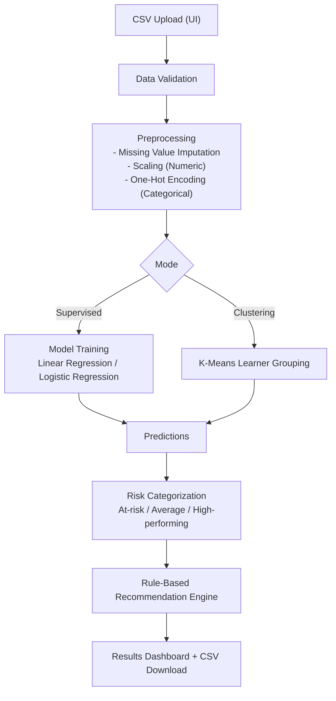

# Milestone 1 Report - Project 2

## 1) Problem Understanding and Use-Case
Educational institutions often have raw performance data (scores, topic accuracy, time spent), but need an actionable way to identify struggling learners early and recommend focused study plans. This system provides ML-based learning analytics for risk detection and basic recommendation generation, without LLMs.

## 2) Input-Output Specification
### Inputs
- CSV file with student-level records.
- Typical fields:
  - `quiz/test/exam scores`
  - `topic-wise accuracy`
  - `time spent per topic`
- For supervised mode: one selected target column (performance/risk/score).

### Outputs
- Model predictions:
  - Regression mode: `predicted_score` + derived `predicted_risk_level`
  - Classification mode: `predicted_category`
- Learner grouping:
  - Categories: `At-risk`, `Average`, `High-performing`
- Study recommendation per learner (`study_recommendation`)
- Metrics:
  - Regression: MAE, R2
  - Classification: Accuracy, Weighted F1
  - Clustering: Silhouette score

## 3) System Architecture Diagram (Traditional ML Pipeline)

## 4) ML/NLP Implementation Summary
- Data preprocessing:
  - Numeric columns: median imputation + standardization
  - Categorical columns: mode imputation + one-hot encoding
- Supervised models:
  - Numeric target: Linear Regression
  - Categorical target: Logistic Regression
- Optional learner grouping:
  - K-Means clustering on scaled numeric features
- Recommendation logic:
  - Rules based on predicted risk/category + weak score/time signals

## 5) Basic UI Coverage
Implemented with Streamlit:
- Upload CSV
- Select mode (supervised/clustering)
- Select target column (supervised)
- View metrics and risk/category distributions
- View downloadable predictions + recommendations

## 6) Brief Model Performance and Limitations
### Performance
- Metrics displayed dynamically based on selected mode.
- Useful for baseline analytics and early warning.

### Limitations of traditional approach
- Depends heavily on feature quality and column consistency.
- Rule-based recommendations are generic, not personalized by learning style.
- No reasoning over external resources or goals.
- Static models may drift without periodic retraining.
- Limited explainability compared to dedicated interpretability toolkits.

## 7) Milestone Scope Confirmation
This implementation is strictly Milestone 1:
- Classical ML only
- No LLM integration
- No agentic workflow
