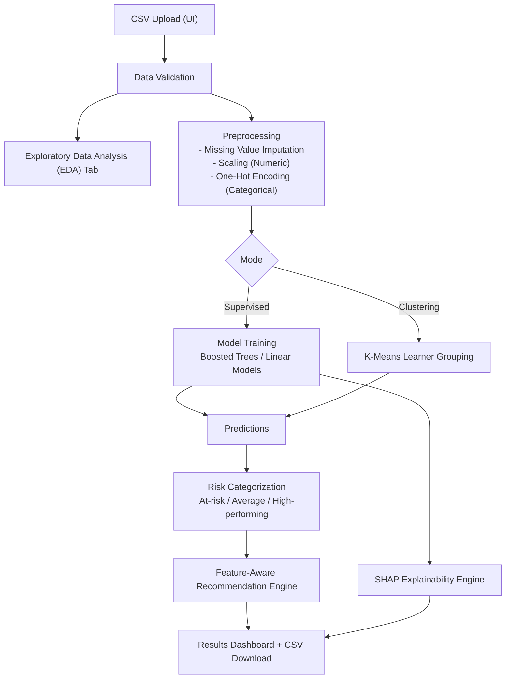

# Milestone 1 Report - Project 2

## 1) Problem Understanding and Use-Case
Educational institutions often have raw performance data (scores, topic accuracy, time spent), but need an actionable way to identify struggling learners early and recommend focused study plans. This system provides ML-based learning analytics for risk detection, deep model explainability, and personalized, feature-aware recommendation generation, without LLMs.

## 2) Input-Output Specification
### Inputs
- CSV file with student-level records.
- Typical fields:
  - `quiz/test/exam scores`
  - `topic-wise accuracy`
  - `time spent per topic`
- For supervised mode: one selected target column (performance/risk/score).

### Outputs
- Exploratory Data Analytics (distributions, correlation heatmaps, target groupings).
- Model predictions:
  - Regression mode: `predicted_score` + derived `predicted_risk_level`
  - Classification mode: `predicted_category`
- Learner grouping:
  - Categories: `At-risk`, `Average`, `High-performing`
- Study recommendation per learner (`study_recommendation`) dynamically referencing weak features by name.
- Model Explainability (SHAP):
  - Global feature importance.
  - Granular positive/negative drivers per specific student.
- Metrics:
  - Regression: MAE, R2
  - Classification: Accuracy, Weighted F1
  - Clustering: Silhouette score

## 3) System Architecture Diagram (Traditional ML Pipeline)

## 4) ML/NLP Implementation Summary
- Data preprocessing:
  - Numeric columns: median imputation + standardization
  - Categorical columns: mode imputation + one-hot encoding
- Supervised models (with CV hyperparameter tuning):
  - Numeric target: Linear Regression, GradientBoostingRegressor
  - Categorical target: Logistic Regression, RandomForest, GradientBoostingClassifier
- Explainability:
  - `shap.TreeExplainer` and `shap.LinearExplainer` for global + local inference contexts.
- Optional learner grouping:
  - K-Means clustering on scaled numeric features
- Recommendation logic:
  - Rules based on predicted risk/category + dynamically parsed weak score/time signals (feature-aware recommendations).

## 5) Basic UI Coverage
Implemented with Streamlit utilizing multiple tabs:
- **Use Case Tab**: Architectural and contextual overview.
- **EDA Tab**: Automatic distributions, missing value sum checks, correlation heatmaps, and target breakdowns.
- **Web App Tab**:
  - Select mode (supervised/clustering).
  - Select target column + hyperparameter tuning preferences.
  - View metrics, risk/category distributions.
  - SHAP expander for global and per-student visual explainability.
  - View downloadable predictions + feature-aware recommendations.
- **Benchmark Tab**: 
  - Compare algorithms dynamically via unified UI against multiple objectives.
  - See auto-formatted summary rankings and highlighted results.

## 6) Brief Model Performance and Limitations
### Performance
- Metrics displayed dynamically based on selected mode.
- Tree-based boosting (GradientBoosting) frequently provides robust scores across classification and regression objectives.
- Fast triaging via personalized insights significantly enhances coordinator productivity.

### Limitations of traditional approach
- Depends heavily on feature quality and column consistency.
- Feature-aware recommendations provide specific focus areas, but still structurally lack "learning-style" specific adaptations.
- No reasoning over external resources or goals.
- Static models may drift without periodic retraining.

## 7) Milestone Scope Confirmation
This implementation is strictly Milestone 1:
- Classical ML only
- No LLM integration
- No agentic workflow
